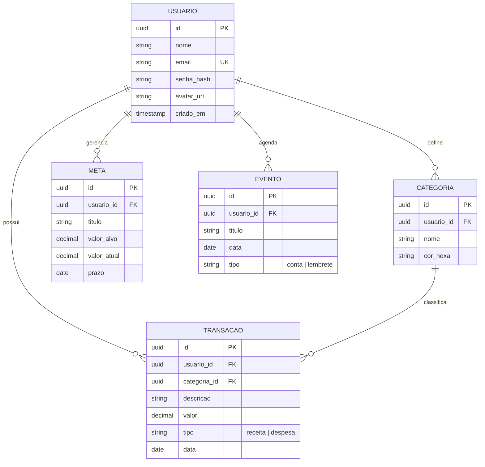

# Rascunho Conceitual (Entidade-Relacionamento) - VaultLedger

Este documento apresenta a modelagem conceitual do banco de dados para a plataforma VaultLedger, focando nas entidades principais e como elas se conectam para suportar as funcionalidades de gestão financeira.

## 1. Diagrama de Entidade-Relacionamento (Mermaid)

## 2. Descrição das Entidades e Atributos

### **Entidade: Usuário**
*O coração do sistema. Todas as outras informações estão vinculadas a um perfil de usuário.*
- **ID:** Identificador único (UUID).
- **Nome/Email:** Dados de identificação e login.
- **Senha Hash:** Armazenamento seguro da credencial.

### **Entidade: Transação**
*O registro de cada entrada ou saída de dinheiro.*
- **Valor:** Armazenado com precisão decimal para evitar erros matemáticos.
- **Tipo:** Diferenciação clara entre o que entra (Income) e o que sai (Expense).
- **Relacionamento:** Vinculada obrigatoriamente a um **Usuário** e a uma **Categoria**.

### **Entidade: Categoria**
*A organização lógica dos gastos.*
- **Cor Hexa:** Usada no frontend para gerar gráficos e identificação visual rápida.
- **Relacionamento:** O usuário pode ter categorias personalizadas, além das padrões.

### **Entidade: Meta**
*O planejamento de futuro.*
- **Valor Atual vs. Alvo:** Permite o cálculo de progresso (%) em tempo real.

### **Entidade: Evento (Agenda)**
*O controle de compromissos financeiros.*
- **Data e Título:** Informações para o calendário.

## 3. Regras de Negócio no Banco de Dados

1. **Integridade Referencial:** Se um usuário for excluído, todos os seus dados dependentes (transações, metas, etc.) devem ser removidos (Cascade Delete) ou anonimizados.
2. **Unicidade de E-mail:** O campo e-mail deve ser único na tabela de usuários para evitar contas duplicadas.
3. **Precisão Monetária:** Campos de valor nunca devem ser do tipo `float`. Devem ser `DECIMAL` ou `NUMERIC`.
4. **Indexação:** Campos como `email` e `usuario_id` devem ser indexados para garantir que as buscas de dados do perfil e do dashboard sejam instantâneas.

---
*Este rascunho serve como base para a implementação do esquema físico em SQL (PostgreSQL).*
